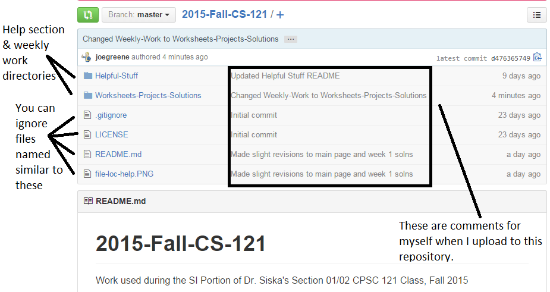

2015-Fall-CS-121
================

Work used during the SI Portion of Dr. Siska's Section 01/02 CPSC 121 Class, Fall 2015

__How to Use This Repository__:

As it is extremely important that you guys get where this is, below is an image of the file listing:

I post all my material in directories (folders and folder paths) of this repository (central location where data is stored, in this case 
CS 121 SI material). Right above "2015-Fall-CS-121" is a list of folders, named exactly for what they represent (Weekly Folder is where 
I keep all our weekly work, and Helpful-Stuff is where I've left a list of useful tips).

The area with Helpful-Stuff and Weekly-Work is called the file listing. Whenever I refer to files/folders in the weekly folders, they are 
always in that same area.

__Meeting Times__: (you might be asked to sign in/out as it is a custom of the CASECS room; if asked such say you're going to my SI)
- Tuesdays:  1:00 - 2:15PM @ CASECS (CS-201; I'll be at the whiteboard, middle table)
- Thursdays: 1:00 - 2:15PM @ CASECS (CS-201; I'll be at the whiteboard, middle table)

__Extra Information__:
- If you need to contact me my email is located at the bottom of this page (and all other pages in this repository). 
- I can also be contacted after class (I normally sit in the back). 
- You can ask me any questions about the course as long as they are not homework related.
- Most (if not all) updates to this repository are done between Thursday evening and Friday evening. 
  - The best time to check for updates is either midday Friday (or if I'm really lagging, Saturday).

I look forward to working with you guys this semester!

-------------------------------------------------------------------------------

Copyright &copy; 2015 Joseph Greene <joeisgreene@csu.fullerton.edu>  
Released under [The MIT License] (http://opensource.org/licenses/MIT)  
Project located at <https://github.com/joegreene/2015-Spring-CS-121>
